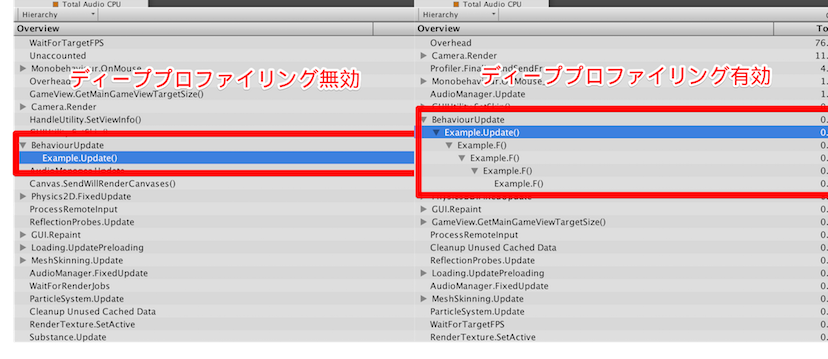

# 魁!!霜田塾

Unity プロファイラー指南  
〜スクリプティングの巻〜

---

## 霜田 孝雄

ﾜﾀｼﾊ ﾌﾟﾛｸﾞﾗﾐﾝｸﾞ ﾁｮｯﾄﾃﾞｷﾙ

Github: [c3-hoge-fuga-piyo](https://github.com/c3-hoge-fuga-piyo)

___

本ドキュメントは下記のいずれかの環境から、  
スライドとして閲覧することを前提としています
- [Slideck](https://slideck.io/)
- [reveal.js](https://github.com/hakimel/reveal.js/)
- [revealgo](https://github.com/yusukebe/revealgo/)

---

## はじめに

---

## 執筆時の環境

- Unity 5.4.0b17
- MacBook Air (11-inch, Mid 2013)
  - OS X 10.11.4
  - 1.7GHz Intel Core i7
  - 8GB 1600 MHz DDR3
  - Intel HD Graphics 5000 1536MB

---

## 本講義の目的

- Unity プロファイラー（以降、「プロファイラー」と表記）から得られるデータから、
  何を最適化すべきかを判断する能力を身につける
  - 今回は特に「スクリプトの最適化」について言及します

---

## 受講者に求めるスキル

- ゲーム開発に対する「実践レベル」の知識
  - 「ゲームの開発経験」が必要です
- Unityに対する「入門書レベル」の知識
  - 「基本的な知識」が必要です
- C#に対する「参考書レベル」の知識
  - 「入門書レベル」以上「実践レベル」以下の知識が必要です

---

## プロファイラーとは？

---

Unityに内蔵されているパフォーマンス計測ツールです

- Windowsにとっての「タスクマネージャー」
- OS Xにとっての「アクティビティモニタ」
- Linuxにとっての「vmstat」

---

### プロファイラーの計測項目

1. CPU使用率
2. GPU使用率
3. レンダリング統計
4. メモリ使用率
5. オーディオ統計
6. 3D/2D物理演算統計
7. ネットワーク統計

---

### 本講義で使用する計測項目

1. CPU使用率 ← これだけ！
2. ~~GPU使用率~~
3. ~~レンダリング統計~~
4. ~~メモリ使用率~~ ← 使用しません
5. ~~オーディオ統計~~
6. ~~3D/2D物理演算統計~~
7. ~~ネットワーク統計~~

---

### 「メモリ使用率」を使用しない理由

- 本講義の目的である「スクリプトの最適化」という観点から見ると「メモリ使用率」から得られるデータの有効性は低いため

___

……そもそも使用されている例を見ない

- Unityから使用されているリソースしか計測できない
- 得られる計測値が正確ではない
  - 特にUnityエディタ上での計測は、エディタが使用しているリソースも計測対象に含まれます
  - より精度の高い値を必要とする場合は、後述する「プレイヤーへのアタッチ」を行います

___

「メモリ使用率」の計測については、  
各プラットフォーム用に提供されている計測ツール  
の使用を推奨します

- Instruments (iOS)
- VTune, Snapdragon Profiler (Android)
- [MemoryProfiler](https://bitbucket.org/Unity-Technologies/memoryprofiler)（Unity 5.3a4 or later）
  - Unity公式の新メモリプロファイラー

___

### プレイヤーへのアタッチ

プレイヤー（ビルドされた成果物）とプロファイラーを接続することにより  
実行中のプレイヤーの計測データをプロファイラー上で確認できるようになります

___

BuildSettingsより、任意のビルドターゲットを選択する（画像ではWebGLを選択）

___

「Development Build」と「Autoconnect Profiler」のチェックボックスを有効にする

___

「Build And Run」より実行すると、実行中のプレイヤーの計測データが自動的にプロファイラーへ送られるようになります

---

## プロファイラーを用いた最適化

___

プロファイラーに関する基本的な情報は  
[公式リファレンス](http://docs.unity3d.com/ja/current/Manual/Profiler.html)で確認できます

---

前述のとおり「スクリプトの最適化」に焦点を絞り、「CPU使用率」から得られるデータについて説明します

---

### CPU使用率エリアについて

1. タイムライン
2. フレーム中の階層データ

___

#### 「フレーム中の階層データ」の表示モード

___

Hierarchy モード

フレーム中で実行されているメソッドの階層表示を行います

___

Timeline モード

Hierarchy モードで得られるデータをタイムライン形式で表示します
- マルチスレッディングがサポートされているプラットフォームでは
  各スレッドのタイムラインが表示されます
  （画像はWebGL環境での計測であるため、メインスレッドのみ表示されています）

___

Raw Hierarchy モード

Hierarchy モードで得られるデータを「オブジェクト単位」で個別に計上します

---

#### CPU使用率のカテゴリ

- Rendering
- Scripts
- Physics
- GarbageCollector
- VSync
- Gi
- Others

___

Rendering

描画処理が含まれます

- より具体的なデータは「レンダリング統計」や「GPU使用率」で確認できます
- 描画の最適化を行う際の指標になります

___

Scripts

スクリプト上で実行される処理が含まれます

- `MonoBehaviour.Update`をはじめとするUnityのイベント関数や、Unity APIの処理すべてが含まれます
  - ユーザー定義のメソッドは後述する「ディーププロファイリング」を行わない限り計測されません
- スクリプトの最適化を行う際の指標になります

___

Physics

物理演算処理が含まれます

- より具体的なデータは「3D/2D物理演算統計」で確認できます
- 物理エンジンを使用した場合のスクリプト、またはレベルデザインの最適化を行う際の指標になります

___

GarbageCollector

ガベージコレクション（GC）処理が含まれます

- GC対象が多いほど負荷が高まり、計測値が大きくなります
- スクリプトの最適化を行う際の指標になります

___

VSync

垂直同期が含まれます

- 「フレーム落ち」までの猶予を表します
- プロファイラー上では`WaitForTargetFPS`として計測されています

___

Gi

グローバルイルミネーション（GI）処理が含まれます

- 描画（ライティング）の最適化を行う際の指標になります

___

Others

既に挙げたカテゴリに含まれないものすべてを含みます

- 何もかもが詰め込まれているため、階層データでよく確認しましょう

---

##### ディーププロファイリング

---

プロファイラーはUnityのイベント関数やUnity APIの実行のみを計上しますが  
「ディーププロファイリング」を有効することにより、ユーザー定義のメソッドも
計測対象に含むようになります

___

プロファイラー上部にある「Deep Profile」ボタンを有効にする

___

下記のコードで実際に計測してみました

___

おわかりいただけただろうか……

---

「ディーププロファイリング」は有用ですが非常に負荷が高く、
場合によっては激しいフレーム落ちにより計測が困難になります

---

「Profiler API」を使う

---

`UnityEngine.Profiler.BeginSample`と`UnityEngine.Profiler.EndSample`を使用することにより、
メソッド中の任意の区間の計測データをプロファイラーに計上することが可能になります

___

下記のコードで実際に計測してみました

___

おわかりいただけただろうか……

---

#### タイムデータ

- CPU
- GPU
- Total
- Self
- Calls
- GC Alloc
- Time ms
- Self ms
- パフォーマンスに関する警告の対象となるオブジェクトの総数

___

CPU

計測フレーム中でCPU側の処理で消費されている時間を示します

___

GPU

計測フレーム中でGPU側の処理で消費されている時間を示します

___

Total

計測フレーム中において、その項目の子階層を含む全体の処理時間が占める割合を示します

- 「階層全体の値」であるため、単体で使用するデータとしては不適切です
- 「割合」であるため、単体で使用するデータとしては不適切です

___

Self

計測フレーム中において、その項目の子階層を含まない単体の処理時間が占める割合を示します

- 「割合」であるため、単体で使用するデータとしては不適切です

___

Calls

計測フレーム中で、その項目が実行されている回数を示します

- スクリプトの最適化を行う際の指標になります

___

GC Alloc

計測フレーム中で、その項目を実行した際にヒープから割り当てられたメモリのサイズを示します

- スクリプトの最適化を行う際の指標になります

___

Time ms

「Total」を時間で表した値です

- 「階層全体の値」であるため、単体で使用するデータとしては不適切です

___

Self ms

「Self」を時間で表した値です

- スクリプトの最適化を行う際の指標になります

___

パフォーマンスに関する警告の対象となるオブジェクトの総数

計測フレーム中の、「パフォーマンスの低下を招く、間違ったUnityの機能の使い方」がされているオブジェクトの総数を示します

- 詳細は[公式マニュアル](http://docs.unity3d.com/ja/current/Manual/ProfilerCPU.html)で確認できます

---

## さいごに

- プロファイラーは「最適化のための計測ツール」である
  - パフォーマンス不足による不具合でもない限り、不具合対応には役立ちません
- 各プラットフォーム用に提供されている計測ツールと併用する
  - プロファイラーはあくまで「Unity用の計測ツール」です
- 「CPU使用率」から得られるデータは開発中の段階から活用する
  - 特に「GarbageCollector」には細心の注意を！

___

## あわせて読みたい

- [Unity - マニュアル: プロファイラー ウィンドウ](http://docs.unity3d.com/ja/current/Manual/Profiler.html)
- [Unity - スクリプトリファレンス: Profiler](http://docs.unity3d.com/ja/current/ScriptReference/Profiler.html)
- Unite 2016 Tokyo - モバイル端末向けのUnityアプリケーションの最適化実践テクニック
  - [FILES](http://japan.unity3d.com/unite/unite2016/files/DAY1_1330_Room1_HarknessDundore_Long_Big.pdf)
  - [MOVIES](https://www.youtube.com/watch?v=bAQP2cH93po)

---

ご清聴ありがとうございました！
